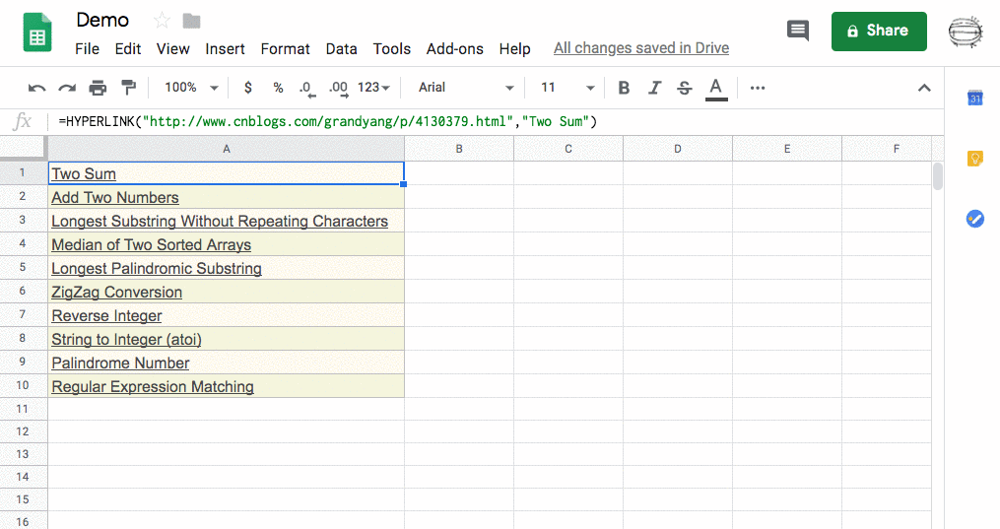

# Links Extractor - Google Sheets Add-ons 

### Available on Chrome Web Store: 
### https://chrome.google.com/webstore/detail/links-extractor/mhafjmjohbgmdabjlbdjnppgljbfkljn

 

 

This is an add-on for Google Spreadsheet that can extract texts and links from user-input range.

### Blog in Chinese

[https://www.cnblogs.com/grandyang/p/10836860.html](https://www.cnblogs.com/grandyang/p/10836860.html)

## Demo:
